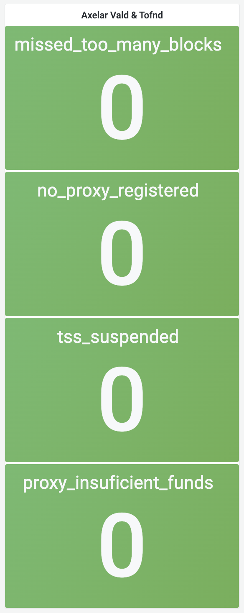

# axelar-services-dashboard
This repo provides grafana dashboards to monitor health Axelar Services
-----
We figured that Axelar is not just any other cosmos blockchain where you just have to monitor your node for uptime and miss block counter. 
#### Axelar has many other services that requires monitoring too, so here are some cool grafana dashboard that will help you monitor Axelar Services Better

All of these dashboard are well color coded
Green -> All Good
Red -> Bad

## External Chain Registration

This dashboard tells where you are registered for external chain or not

Suppose you get auto deregistered from Fantom, then the dashboard will change color to Red

## Votes

It's very important to monitor if you are  voting correctly on other chains are not
It is color coded as well, so if you missed or voted wrongly on any chain, the red will catch your eye

## Others
Dashboard for missed_too_many_blocks, no_proxy_registered, tss_suspended, proxy_insuficient_funds
This is also an important one as it highlights where you have enough funds in your broadcaster address or not among some significant things to monitor

